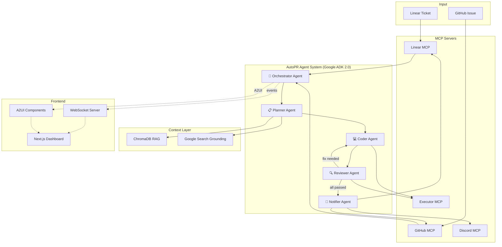

# AutoPR: Context-Aware Work Item to PR Agent — Implementation Plan

> **Hackathon project** built with **Google ADK 2.0**, featuring a multi-agent hierarchy, 4 MCP servers, a custom Next.js dashboard, and 7 innovative differentiating features.

## Summary of Decisions

| Area | Decision |
|---|---|
| Framework | Google ADK 2.0 (Python) |
| Work Trackers | Linear (primary) + GitHub Issues (adapter) |
| Frontend | Next.js + WebSocket + A2UI |
| Agent Architecture | Multi-agent hierarchy: Orchestrator → Planner, Coder, Reviewer, Notifier |
| Models | Gemini 2.5 Pro/Flash + optional local LLM via Ollama |
| Notifications | Discord webhooks |
| RAG | ChromaDB in-memory + Google Search grounding |
| MCP Servers | GitHub, Linear, Discord, Code Execution |
| Team Split | Person A → Backend, Person B → Frontend |
| Theme | Light professional (Linear/Notion-inspired) |
| Demo Target | This AutoPR repo itself |

---

## User Review Required

> [!IMPORTANT]
> **API Keys & Secrets**: Your Gemini API key will be stored in a `.env` file (`.gitignore`'d). You'll also need:
> - A **Linear API key** (free account → Settings → API)
> - A **GitHub Personal Access Token** (with `repo` scope)
> - A **Discord Webhook URL** (create in any Discord server → Channel Settings → Integrations → Webhooks)

> [!WARNING]
> **Scope Management**: We've selected 7 innovation features. If time runs short during the hackathon, I recommend prioritizing in this order:
> 1. Core pipeline (must-have) — fetch ticket → code → validate → PR
> 2. Live workflow visualization (most visual impact)
> 3. Natural language PR summary + Code diff preview (easy wins)
> 4. Confidence scoring + Human-in-the-loop
> 5. Intentional failure demo mode
> 6. BRD injection demo
> 7. Smart escalation

---

## Open Questions

> [!IMPORTANT]
> 1. **Which person are you (A or B)?** This determines what we build first — backend agents or frontend dashboard.
> 2. **Do you already have a Linear account?** If not, sign up at [linear.app](https://linear.app) (free tier).
> 3. **Do you have a Discord server** where we can create a webhook for testing?
> 4. **Hackathon deadline?** This affects how we prioritize features.

---

## Architecture Overview



---

## Proposed Changes

### Component 1: Project Foundation

#### [NEW] `pyproject.toml`
Python project configuration with all dependencies:
- `google-adk>=2.0` — Agent Development Kit
- `fastapi` + `uvicorn` — WebSocket/REST API server
- `chromadb` — In-memory vector store for RAG
- `pygithub` — GitHub API client
- `httpx` — Async HTTP client (for Linear GraphQL, Discord webhooks)
- `python-dotenv` — Environment variable management
- `pydantic` — Data models
- `google-genai` — Gemini API SDK

#### [NEW] `.env.example`
Template for required environment variables:
```
GEMINI_API_KEY=
LINEAR_API_KEY=
GITHUB_TOKEN=
DISCORD_WEBHOOK_URL=
OLLAMA_BASE_URL=http://localhost:11434  # optional
```

#### [NEW] `.gitignore`
Standard Python + Node.js gitignore, including `.env`, `__pycache__`, `node_modules`, `.next`, `chroma_data/`

#### [NEW] `README.md`
Professional README with badges, architecture diagram, setup instructions, and usage guide.

---

### Component 2: ADK Agents (`autopr/agents/`)

Each agent follows the Google ADK 2.0 pattern with `Agent()` definitions, system instructions, and tool bindings.

#### [NEW] `autopr/agents/__init__.py`
Package init, exports all agents.

#### [NEW] `autopr/agents/orchestrator.py`
**The root agent** — receives a work item ID, delegates to sub-agents in sequence.
- System instruction: "You are AutoPR's orchestrator. Given a work item ID, coordinate the pipeline."
- Delegates to: PlannerAgent → CoderAgent → ReviewerAgent → NotifierAgent
- Emits **WebSocket events** at each stage transition for the dashboard
- Implements **confidence scoring**: after each sub-agent returns, evaluates confidence level
- Handles **Smart Escalation**: if ReviewerAgent fails N times, creates a "help wanted" issue

#### [NEW] `autopr/agents/planner.py`
**Reads the ticket, retrieves context, creates an implementation plan.**
- Tools: `fetch_work_item`, `search_codebase`, `retrieve_docs`, `google_search`
- Uses RAG pipeline to find relevant code files
- Outputs a structured `ImplementationPlan` (Pydantic model) with:
  - Files to modify/create
  - Test strategy
  - Relevant context snippets
  - Confidence score

#### [NEW] `autopr/agents/coder.py`
**Implements the changes based on the plan.**
- Tools: `read_file`, `write_file`, `create_file`, `run_command`
- Takes `ImplementationPlan` as input
- Generates code changes + test files
- Uses Gemini's code generation capabilities
- Optional: local LLM fallback via Ollama for simpler changes

#### [NEW] `autopr/agents/reviewer.py`
**Validates the implementation.**
- Tools: `run_tests`, `run_lint`, `run_typecheck`, `analyze_failures`
- Runs validation commands from repo config (respects `.eslintrc`, `pytest.ini`, etc.)
- If failures detected:
  - Analyzes error output
  - Creates a fix plan
  - Delegates back to CoderAgent (max 3 retry loops)
- Outputs validation report with pass/fail status

#### [NEW] `autopr/agents/notifier.py`
**Creates PR, updates ticket, sends notifications.**
- Tools: `create_pull_request`, `update_work_item_status`, `send_discord_notification`
- Generates **natural language PR summary** (what changed, why, how validated)
- Creates rich Discord embed with PR link, summary, and validation results
- Updates Linear ticket status: Dev In Progress → Submitted for Review

---

### Component 3: MCP Servers (`autopr/mcp_servers/`)

Each MCP server is a standalone Python module that exposes tools via the MCP protocol.

#### [NEW] `autopr/mcp_servers/github_server.py`
GitHub MCP server with tools:
- `create_branch` — create a feature branch from main
- `read_file` — read file contents from repo
- `write_file` — write/update file in repo
- `create_pull_request` — create PR with title, body, branch
- `list_files` — list files in a directory
- `get_diff` — get diff between branches
- `create_issue` — create "help wanted" issue for smart escalation

#### [NEW] `autopr/mcp_servers/linear_server.py`
Linear MCP server with tools:
- `get_issue` — fetch issue by ID with title, description, labels, assignees, acceptance criteria
- `update_issue_status` — update issue state (Todo → In Progress → In Review → Done)
- `add_comment` — add a comment to the issue
- `list_issues` — list issues in a project (for demo purposes)

#### [NEW] `autopr/mcp_servers/discord_server.py`
Discord MCP server with tools:
- `send_notification` — send rich embed message to a Discord channel via webhook
- `send_status_update` — send status change notification
- Supports rich embeds with colors, fields, timestamps, and PR links

#### [NEW] `autopr/mcp_servers/executor_server.py`
Sandboxed Code Execution MCP server with tools:
- `run_command` — execute shell commands in a sandboxed environment
- `run_tests` — run test suite (auto-detects pytest, jest, go test, etc.)
- `run_lint` — run linter (auto-detects eslint, flake8, ruff, etc.)
- `run_build` — run build command
- Includes timeout, resource limits, and output capture
- Returns structured results (exit code, stdout, stderr, duration)

---

### Component 4: RAG Pipeline (`autopr/rag/`)

#### [NEW] `autopr/rag/indexer.py`
Repository indexer that:
- Walks the target repository file tree
- Filters by relevant extensions (.py, .ts, .js, .md, .json, .yaml, etc.)
- Chunks files intelligently (by function/class for code, by section for docs)
- Generates embeddings using Gemini's text-embedding model
- Stores in ChromaDB collection

#### [NEW] `autopr/rag/retriever.py`
Context retriever that:
- Takes a query (from the work item or planner agent)
- Performs semantic search over the ChromaDB collection
- Returns top-k relevant code snippets, docs, and config files
- Includes file path, line numbers, and relevance score

#### [NEW] `autopr/rag/grounding.py`
Google Search grounding integration:
- Uses `google_search` tool for external documentation lookup
- Retrieves relevant API docs, library references, best practices
- Combines with repo-level context for comprehensive grounding

---

### Component 5: API Server (`autopr/api/`)

#### [NEW] `autopr/api/server.py`
FastAPI application with:
- **REST endpoints**:
  - `POST /api/run` — start a new AutoPR pipeline with a work item ID
  - `GET /api/runs` — list all pipeline runs with status
  - `GET /api/runs/{run_id}` — get detailed run info
  - `POST /api/demo/inject-failure` — inject a bug for demo mode
  - `POST /api/demo/inject-brd` — simulate BRD injection
- **WebSocket endpoint**:
  - `WS /ws/{run_id}` — real-time event stream for a pipeline run

#### [NEW] `autopr/api/events.py`
WebSocket event schema (shared contract between backend and frontend):
```python
class PipelineEvent:
    run_id: str
    timestamp: datetime
    event_type: str  # "stage_start", "stage_complete", "tool_call", "reasoning", "error", "confidence_update", "human_input_required", "pr_created"
    stage: str       # "planning", "coding", "reviewing", "notifying"
    data: dict       # event-specific payload
```

#### [NEW] `autopr/api/models.py`
Pydantic request/response models for all API endpoints.

---

### Component 6: Configuration (`autopr/config/`)

#### [NEW] `autopr/config/settings.py`
Central configuration using Pydantic Settings:
- API keys (from .env)
- Model selection (Gemini Pro/Flash/Ollama)
- Default retry limits
- Confidence thresholds
- Repository paths

#### [NEW] `autopr/config/model_registry.py`
Model abstraction layer:
- `get_model(name)` returns configured model client
- Supports: `gemini-2.5-pro`, `gemini-2.5-flash`, `ollama/<model-name>`
- Allows per-agent model override

---

### Component 7: Frontend Dashboard (`dashboard/`)

#### [NEW] `dashboard/` (Next.js project)
Initialize with `npx create-next-app@latest` with TypeScript, App Router, and ESLint.

#### [NEW] `dashboard/src/app/page.tsx`
**Main dashboard page** with:
- Hero section with AutoPR branding
- Work Item ID input field
- "Start Pipeline" button
- Recent runs list

#### [NEW] `dashboard/src/app/run/[id]/page.tsx`
**Pipeline run detail page** with:
- **Workflow graph** — animated node graph showing pipeline stages
- **Live log panel** — streaming agent reasoning, tool calls
- **Code diff panel** — side-by-side diff preview (Monaco editor or similar)
- **Validation results** — pass/fail badges for each check
- **Confidence meter** — visual confidence score with threshold indicator
- **A2UI container** — renders interactive components sent by the agent
- **PR result card** — shows created PR with link and summary

#### [NEW] `dashboard/src/components/WorkflowGraph.tsx`
Animated pipeline visualization:
- Nodes: Fetch → Plan → Code → Validate → PR → Notify
- States: pending (gray), active (blue pulse), complete (green), error (red), retry (orange)
- Edges animate as data flows between stages
- Use a library like `reactflow` or custom SVG animation

#### [NEW] `dashboard/src/components/LiveLog.tsx`
Real-time log stream:
- Color-coded entries (reasoning = blue, tool calls = purple, errors = red)
- Auto-scroll with sticky bottom
- Collapsible sections for verbose output

#### [NEW] `dashboard/src/components/CodeDiffPreview.tsx`
Side-by-side code diff viewer:
- Syntax highlighted
- Shows files changed, lines added/removed
- Uses Monaco Editor diff component or `react-diff-viewer`

#### [NEW] `dashboard/src/components/ConfidenceMeter.tsx`
Visual confidence indicator:
- Animated arc/gauge from 0-100%
- Color gradient: red → yellow → green
- Threshold line showing "human review needed" cutoff

#### [NEW] `dashboard/src/components/A2UIRenderer.tsx`
A2UI component renderer:
- Parses A2UI JSON payloads from the agent
- Renders interactive components (buttons, forms, confirmations)
- Sends user responses back via WebSocket

#### [NEW] `dashboard/src/lib/websocket.ts`
WebSocket client hook:
- Connects to `WS /ws/{run_id}`
- Parses `PipelineEvent` messages
- Distributes events to appropriate UI components
- Auto-reconnect on disconnect

#### [NEW] `dashboard/src/styles/`
Design system:
- Light professional theme (clean whites, subtle grays, accent blue)
- Typography: Inter font
- Spacing: 4px grid
- Shadows: subtle elevation
- Animations: smooth transitions (300ms ease)
- Inspired by Linear/Notion aesthetics

---

### Component 8: Demo & Testing

#### [NEW] `autopr/tests/`
Test suite:
- Unit tests for each agent (mock tool responses)
- Unit tests for MCP server tools
- Integration test for full pipeline (mock external APIs)
- Test for RAG indexer and retriever

#### [NEW] `scripts/demo_setup.py`
Demo preparation script:
- Creates sample Linear tickets for the demo
- Sets up the target repo with demo-ready code
- Pre-indexes the repo for faster demo startup

#### [NEW] `scripts/inject_failure.py`
Intentional failure injection:
- Introduces a syntax error or failing test into a known file
- Used by the "Demo Mode" button in the dashboard

---

## Work Breakdown — Person A (Backend)

| Phase | Tasks | Priority |
|---|---|---|
| **Phase 1: Foundation** | Project setup, pyproject.toml, .env, config, model registry | P0 |
| **Phase 2: MCP Servers** | GitHub MCP, Linear MCP, Discord MCP, Executor MCP | P0 |
| **Phase 3: RAG Pipeline** | ChromaDB indexer, retriever, grounding integration | P0 |
| **Phase 4: Agents** | Orchestrator, Planner, Coder, Reviewer, Notifier | P0 |
| **Phase 5: API Server** | FastAPI + WebSocket server, event schema | P0 |
| **Phase 6: Innovation** | Confidence scoring, smart escalation, failure injection | P1 |
| **Phase 7: Testing** | Unit tests, integration tests, demo scripts | P1 |

## Work Breakdown — Person B (Frontend)

| Phase | Tasks | Priority |
|---|---|---|
| **Phase 1: Foundation** | Next.js setup, design system, layout components | P0 |
| **Phase 2: Core Pages** | Main dashboard page, run detail page | P0 |
| **Phase 3: Workflow Graph** | Animated pipeline visualization with reactflow | P0 |
| **Phase 4: Live Features** | WebSocket client, live log panel, event handling | P0 |
| **Phase 5: Rich Components** | Code diff preview, confidence meter, A2UI renderer | P1 |
| **Phase 6: Polish** | Animations, responsive design, loading states, error states | P1 |
| **Phase 7: Demo Mode** | Demo controls UI, failure injection button, BRD injection | P1 |

---

## Verification Plan

### Automated Tests
```bash
# Backend tests
cd autopr && pytest tests/ -v

# Frontend tests
cd dashboard && npm run lint && npm run build

# Full pipeline test (mock mode)
python -m autopr.tests.integration_test
```

### Manual Verification
1. **End-to-end demo**: Create a Linear ticket → Run pipeline → Verify PR created on GitHub → Check Discord notification
2. **Failure recovery demo**: Inject a bug → Watch agent detect and fix it → Verify clean PR
3. **BRD injection demo**: Add a BRD document mid-run → Verify agent adapts
4. **Human-in-the-loop demo**: Trigger low-confidence scenario → Verify A2UI approval dialog appears
5. **Dashboard verification**: Check all UI components render correctly with real-time data

---

## Key API Contract (Backend ↔ Frontend)

This is the shared WebSocket event schema that both teammates must agree on:

```typescript
// WebSocket Event Types
type EventType =
  | "pipeline_started"
  | "stage_started"       // { stage: "planning" | "coding" | "reviewing" | "notifying" }
  | "stage_completed"     // { stage, result, duration_ms }
  | "tool_called"         // { tool_name, args, result }
  | "reasoning"           // { thought: string }
  | "confidence_update"   // { score: number, threshold: number }
  | "human_input_needed"  // { prompt: string, options: string[], a2ui_component: object }
  | "error"               // { message, stage, recoverable }
  | "retry_started"       // { attempt, max_attempts, reason }
  | "code_changes"        // { files: { path, diff, action }[] }
  | "validation_result"   // { checks: { name, status, output }[] }
  | "pr_created"          // { url, title, summary }
  | "pipeline_completed"  // { success, pr_url, duration_ms }

interface PipelineEvent {
  run_id: string;
  timestamp: string;     // ISO 8601
  event_type: EventType;
  stage: string;
  data: Record<string, any>;
}
```

---

## Getting Started — Immediate Next Steps

1. **Both**: Review and approve this plan
2. **Person A**: Set up Python project structure + `.env` + first MCP server (GitHub)
3. **Person B**: Initialize Next.js dashboard + design system + layout
4. **Both**: Agree on the WebSocket event schema above
5. **Both**: Create Linear workspace + first demo ticket
